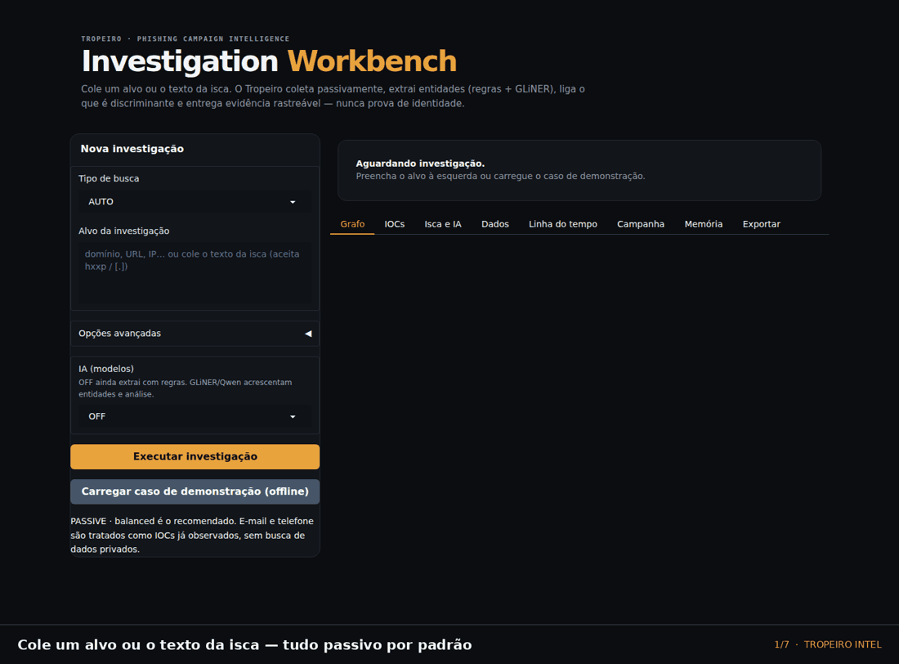
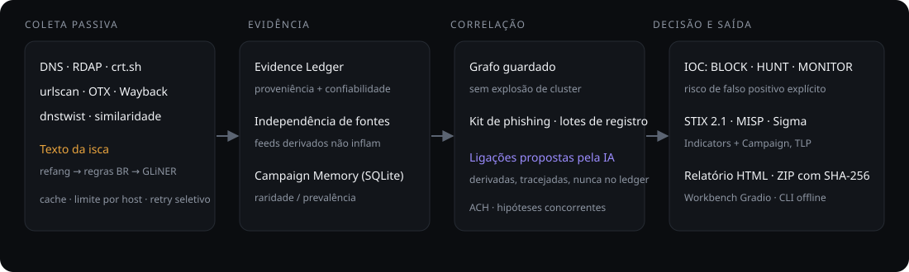
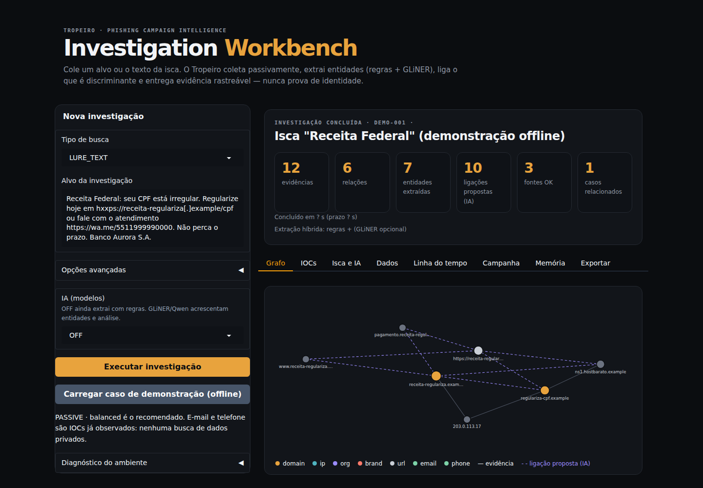
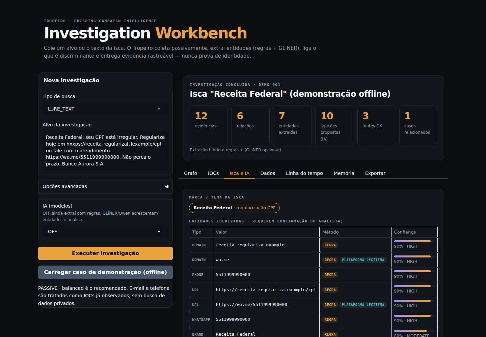
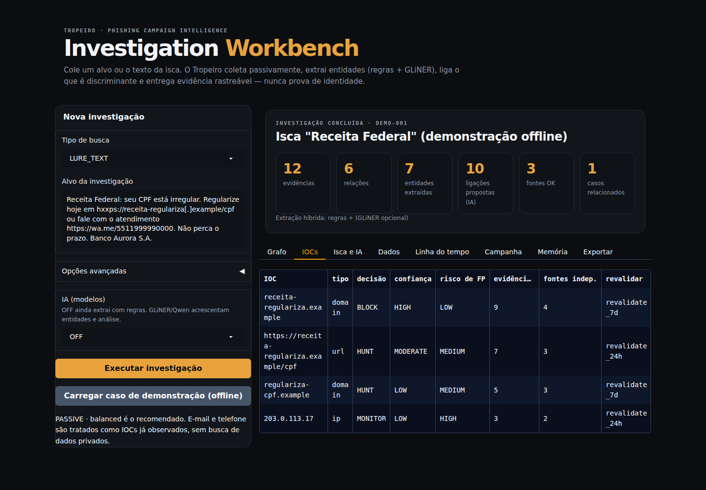
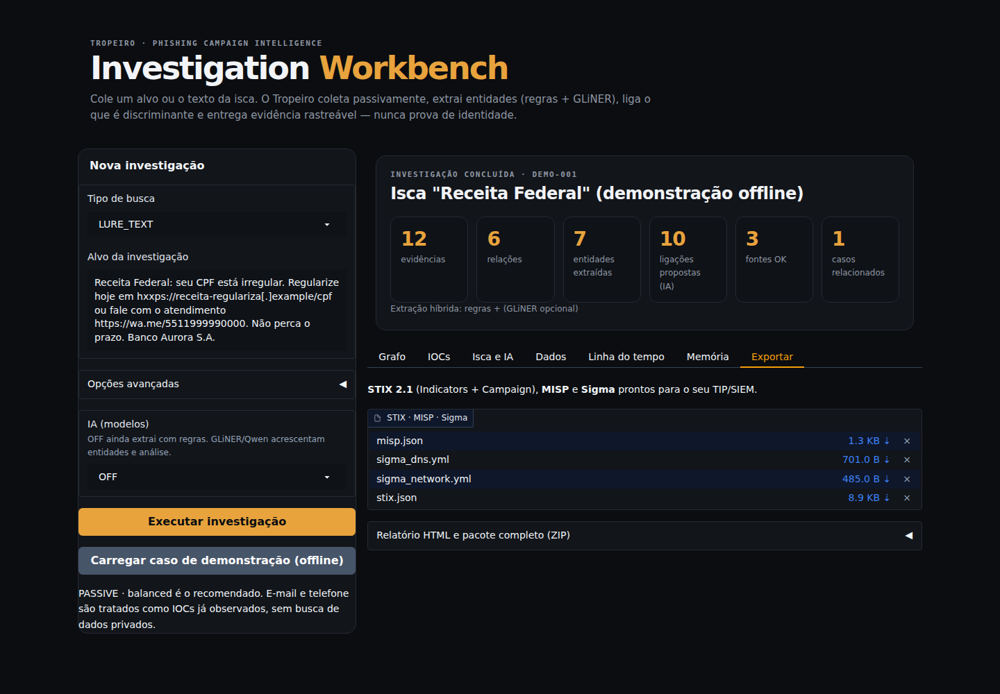

<p align="center"></p>

<h1 align="center">Tropeiro Intel</h1>

<p align="center"><b>Campaign intelligence for phishing investigations.</b><br>
Evidência rastreável, correlação cautelosa e IA verificada — nunca prova automática de identidade.</p>

<p align="center">
  <a href="https://colab.research.google.com/github/Ridd1kulusC0d3r/tropeiro-intel/blob/main/notebooks/Tropeiro_Intel_Official_Colab.ipynb"></a>
  <a href="https://github.com/Ridd1kulusC0d3r/tropeiro-intel/actions/workflows/ci.yml"></a>
  
  
  
</p>

<p align="center"></p>

<p align="center"><sub>Caso de demonstração 100% offline (domínios <code>.example</code>, IPs de documentação). Reproduza com <code>python scripts/make_demo_media.py</code>.</sub></p>

## Por que o Tropeiro

| | Ferramentas típicas | Tropeiro |
|---|---|---|
| **Confiança** | um score opaco | evidência com proveniência; fontes derivadas não inflam a confiança |
| **Correlação** | tudo que compartilha IP vira cluster | clusters guardados contra infraestrutura comum; prevalência/raridade entre casos |
| **IA** | resposta em texto livre | GLiNER e Qwen só propõem; toda referência é validada contra o Evidence Ledger e achados sem suporte são rebaixados |
| **Brasil** | iscas genéricas | Receita, Correios, PIX, Detran, INSS; CPF/CNPJ com dígito verificador, chave PIX, WhatsApp |
| **Saída** | PDF | STIX 2.1 (Indicators + Campaign), MISP, Sigma, relatório HTML, ZIP com SHA-256 |

## Início rápido

```bash
pip install -e ".[colab]"          # inclui Gradio
tropeiro workbench                 # Workbench em http://127.0.0.1:7860 (o botão "caso de demonstração" funciona sem rede)
tropeiro lure examples/lure_receita.txt --case C1 --out out/   # CLI offline: marca, IOCs, STIX/MISP/Sigma
```

Ou abra no **[Google Colab](https://colab.research.google.com/github/Ridd1kulusC0d3r/tropeiro-intel/blob/main/notebooks/Tropeiro_Intel_Official_Colab.ipynb)** — nenhuma API paga é necessária.

## Arquitetura

<p align="center"></p>

```text
COLLECT → NORMALIZE → EVIDENCE → CORRELATE → ASSESS → ATTRIBUTE → DECIDE → PIVOT → REPORT
```

Detalhes: [ARCHITECTURE](docs/ARCHITECTURE.md) · [Camada de IA](docs/AI.md) · [Modelo de dados](docs/DATA_MODEL.md)

## Documentação

| Quero... | Leia |
|---|---|
| primeira investigação em 5 minutos | [Início rápido](docs/QUICKSTART.md) |
| usar o Workbench aba por aba | [Guia do Workbench](docs/USER_GUIDE.md) |
| analisar uma isca pela linha de comando | [CLI](docs/CLI.md) |
| seguir um passo a passo (triagem, takedown, regras...) | [Receitas](docs/COOKBOOK.md) |
| entender BLOCK / HUNT / MONITOR | [Interpretando resultados](docs/INTERPRETING_RESULTS.md) |
| instalar e configurar chaves, cache, memória | [Instalação](docs/INSTALLATION.md) · [Configuração](docs/CONFIGURATION.md) |
| formatos STIX / MISP / Sigma | [Saídas](docs/OUTPUTS.md) |
| usar como biblioteca Python | [API Python](docs/PYTHON_API.md) |
| tirar dúvidas | [FAQ](docs/FAQ.md) · [Erros comuns](docs/COMMON_ERRORS.md) |

Índice completo: [docs/README.md](docs/README.md).

## Capturas

<table>
<tr><td></td><td></td></tr>
<tr><td></td><td></td></tr>
</table>

---

## Novidades · What's new

**EN:** Offline CLI (`pip install -e . && tropeiro lure examples/lure.txt --out out/`) that classifies Brazilian phishing lures, extracts IOCs plus PIX/WhatsApp infrastructure and exports STIX 2.1 (Indicators + Campaign), MISP and Sigma. New helpers: phishing-kit fingerprinting, registration-batch clustering, confidence calibration.

**PT:** CLI offline para analisar iscas brasileiras (Receita, Correios, PIX, Detran...), extrair IOCs, CPF/CNPJ válidos, chave PIX e WhatsApp, e exportar STIX/MISP/Sigma. Veja o [CHANGELOG](CHANGELOG.md).

> **Maturity note:** items marked ✅ below are implemented; the depth varies. Treat `reporting/` exports and `storage/case_store.py` as *beta*; `memory/store.py` is the main persistence layer.

## Primeira vez usando Colab ou OSINT?

Comece pelo **[Guia para iniciantes](docs/BEGINNER_GUIDE.md)**.

A **4.1 Guided Investigation Station** inclui um assistente que muda o campo de entrada conforme o caso:

```text
Domínio
URL
IP
E-mail observado
Hash
Telefone observado
Vários IOCs
Texto da isca
```

Também há uma caixa **🧭 Antes de executar** imediatamente antes de cada etapa do notebook explicando objetivo, como usar, saída esperada, erros mais comuns e o que fazer quando algo falhar.

Material essencial:

- [Guia para iniciantes](docs/BEGINNER_GUIDE.md)
- [Tipos de busca](docs/SEARCH_TYPES.md)
- [Erros comuns](docs/COMMON_ERRORS.md)
- [Glossário](docs/GLOSSARY.md)

## Start here

### ▶ [Open Tropeiro Intel in Google Colab](https://colab.research.google.com/github/Ridd1kulusC0d3r/tropeiro-intel/blob/main/notebooks/Tropeiro_Intel_Official_Colab.ipynb)

No paid API is required for the core workflow.

For a first investigation:

1. run **01 · Bootstrap**;
2. run **02 · Health Check**;
3. configure the target in **04 · Assistente guiado**;
4. keep **PASSIVE**;
5. keep **Usar plano automático recomendado** in step 05;
6. continue in order.

## Simple Colab frontend

After bootstrap, the notebook can launch a **Gradio Investigation Workbench inside Colab**. It provides target input, mode/budget controls, optional GLiNER/Qwen, source health, IOC/evidence/relationship tables and report/package downloads.

The frontend is a convenience layer over the same `tropeiro/` backend. The full notebook remains available for advanced analysis.

## Guided investigation

The visible input changes according to the selected or detected IOC type. Internally the guided layer still populates the stable backend objects and variables, preserving advanced workflows.

The automatic scan plan considers:

- effective input type;
- PASSIVE / SAFE_ENRICHMENT / AUTHORIZED_ACTIVE;
- provider budget;
- configured secrets;
- brand context;
- number of targets.

Advanced analysts can disable automatic planning and manually control every feature.

## What Tropeiro answers

- What is related to this IOC?
- Which relationships are actually discriminating?
- Which infrastructure is shared, reused or merely coincidental?
- Which domains appear to belong to the same campaign?
- Is there evidence for a common operator, or only a shared kit/provider?
- What is still unknown?
- Which pivot is worth pursuing next?
- Which IOCs are suitable for **BLOCK, HUNT, MONITOR or TAKEDOWN PREP**?
- How strong is the attribution, and what alternative hypotheses remain?

## Core capabilities

| Capability | Status | Purpose |
|---|---|---|
| Guided IOC input | ✅ | dynamic DOMAIN / URL / IP / EMAIL / HASH / PHONE / MULTI / LURE input |
| Automatic scan plan | ✅ | recommends modules from case context |
| Multi-IOC ingestion | ✅ | normalizes mixed indicators |
| Passive DNS / RDAP / CT | ✅ | registration and infrastructure evidence |
| Wayback / Common Crawl | ✅ | historical web context |
| urlscan / OTX | ✅ | passive enrichment and scan history |
| VirusTotal / ThreatFox | Optional | threat-intelligence enrichment |
| dnstwist | ✅ | lookalike candidate generation |
| Domain similarity | ✅ | lexical/token/confusable comparison |
| Evidence Ledger | ✅ | provenance and source reliability |
| Source independence | ✅ | prevents derived feeds from inflating confidence |
| Relationship graph | ✅ | typed entity relationships |
| Guarded clustering | ✅ | reduces cluster explosion on shared infrastructure |
| Campaign / operator fingerprints | ✅ | separate operational representations |
| Campaign Memory | ✅ | persistent cross-case comparison and historical similarity |
| Prevalence / rarity engine | ✅ | downweights common artifacts across saved cases |
| Attribution / ACH | ✅ | competing hypotheses and attribution ladder |
| PIRs / collection gaps | ✅ | unanswered intelligence requirements |
| Next Best Pivot | ✅ | ranks useful next collection steps |
| IOC Decision Objects | ✅ | actionability and FP control |
| Detection bridge | ✅ | hunt/detection candidates |
| Local rich report | ✅ | offline HTML + selective export |
| DNSDumpster / FOFA / Censys | Optional | deeper enrichment |

## Campaign Memory / Cross-Case Intelligence

Version 4.4 can persist normalized artifacts from prior cases in a local SQLite database and compare new investigations against historical cases.

It adds related-case ranking, rarity/prevalence, explainable shared-artifact contributions and penalties for common infrastructure. Cross-case similarity is not same-operator attribution.

See [Campaign Memory](docs/CAMPAIGN_MEMORY.md).

## Analytical guardrails

```text
Infrastructure ownership ≠ campaign membership
Campaign membership       ≠ common operator
Common operator           ≠ real-world identity
Real-world identity       ≠ known threat actor
```

Shared IPs, ASNs, registrars, CDNs and hosting providers are not sufficient attribution.

## API keys and secrets

Optional secrets can be configured in the Colab key icon:

```text
URLSCAN_API_KEY
VT_API_KEY
THREATFOX_AUTH_KEY
DNSDUMPSTER_API_KEY
FOFA_API_KEY
CENSYS_PAT
CENSYS_ORG_ID
```

Do not paste API keys into public notebook cells.

## Documentation

- [Beginner guide](docs/BEGINNER_GUIDE.md)
- [Search types](docs/SEARCH_TYPES.md)
- [Common errors](docs/COMMON_ERRORS.md)
- [Glossary](docs/GLOSSARY.md)
- [Quick start](docs/QUICKSTART.md)
- [Official Colab guide](docs/COLAB.md)
- [Intelligence model](docs/INTELLIGENCE_MODEL.md)
- [Architecture](docs/ARCHITECTURE.md)
- [Attribution engineering](docs/ATTRIBUTION.md)
- [Data model](docs/DATA_MODEL.md)
- [Actionable intelligence](docs/ACTIONABLE_INTELLIGENCE.md)
- [Reporting UX](docs/REPORTING_UX.md)
- [Campaign Memory](docs/CAMPAIGN_MEMORY.md)
- [Security and safe use](SECURITY.md)
- [Troubleshooting](docs/TROUBLESHOOTING.md)
- [Roadmap](docs/ROADMAP.md)
- [Feature validation matrix](docs/FEATURE_MATRIX.md)

## Local Python usage

```bash
git clone https://github.com/Ridd1kulusC0d3r/tropeiro-intel.git
cd tropeiro-intel
python -m venv .venv
source .venv/bin/activate
pip install -e ".[dev,colab]"
pytest -q
```

## Safety model

- Passive by default.
- Direct HTTP probing is opt-in and requires authorization.
- No resource claiming or takeover exploitation.
- No private-PII hunting or doxxing workflows.
- Observed e-mails/phones are correlation indicators, not invitations to search for private owners.
- Attribution is evidence-backed confidence, not accusation.

## Project status

Current public release: **4.4 Campaign Memory**.

## License

Apache-2.0. See [LICENSE](LICENSE).
