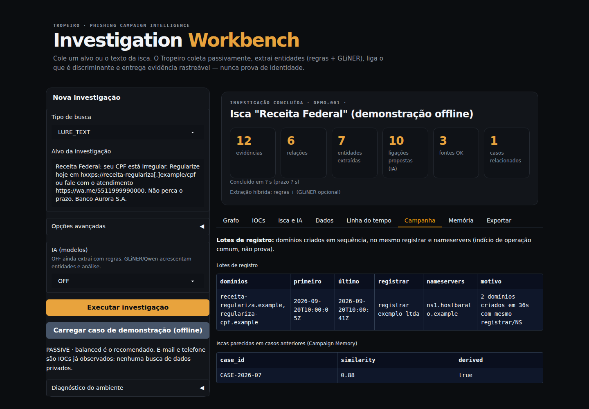
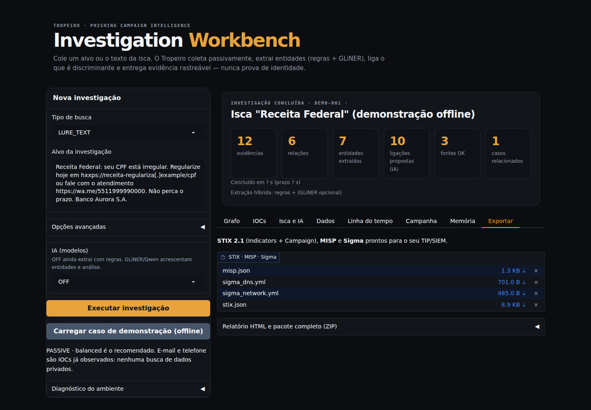

# Guia do Workbench

O Workbench é a interface web do Tropeiro. Ele roda no seu computador (ou no Colab) e transforma um alvo — domínio, URL, IP ou o **texto de uma isca** — em evidência, relações, decisão por IOC e exportações.

```bash
tropeiro workbench                 # abre o navegador na primeira porta livre a partir de 7860
tropeiro workbench --port 8080     # porta fixa
tropeiro workbench --no-browser    # servidor/SSH: só imprime a URL
```

No Colab: `from tropeiro.frontend.app import launch_colab_frontend; launch_colab_frontend()`.

> Tudo que você cola fica no seu ambiente. A interface **não** envia o texto da isca a serviços externos; as consultas de coleta usam apenas domínios e hostnames. `--share` cria um link público temporário do Gradio: evite em casos reais.

## Primeiros 2 minutos (sem rede)

1. Rode `tropeiro workbench`.
2. Clique em **Carregar caso de demonstração (offline)**.
3. Passe pelas abas **Grafo → IOCs → Isca e IA → Linha do tempo → Exportar**.

O caso de demonstração usa uma isca fictícia da "Receita Federal" com domínios `.example`, então nada é consultado na internet.


## O painel esquerdo: nova investigação

| Campo | O que colocar |
|---|---|
| **Tipo de busca** | `AUTO` detecta pelo formato. Escolha manualmente se errar: `DOMAIN`, `URL`, `IP`, `EMAIL`, `HASH`, `PHONE`, `MULTI_IOC` (um por linha) ou `LURE_TEXT` (texto da mensagem). Veja [SEARCH_TYPES](SEARCH_TYPES.md) |
| **Alvo da investigação** | domínio, URL, IP... ou cole a mensagem inteira. Aceita defang (`hxxps://x[.]com`) |
| **IA (modelos)** | `OFF` (padrão) ainda extrai com **regras**. `GLINER_ONLY` acrescenta o GLiNER. `GLINER_QWEN` acrescenta também uma análise do Qwen. `AUTO` roda o GLiNER e só usa o Qwen se houver GPU |
| **Opções avançadas** | ID do caso, analista, marca, organização imitada, modo, profundidade, Campaign Memory e caminho da memória |

Botões: **Executar investigação** (coleta real), **Carregar caso de demonstração** (offline) e, em **Diagnóstico do ambiente**, **Rodar diagnóstico** (veja abaixo).

> **Modo e profundidade** (em *Opções avançadas*) decidem quais fontes rodam e quantos detalhes de scan são baixados. Veja [CONFIGURATION](CONFIGURATION.md#o-que-liga-em-cada-superfície).

## Durante a busca

Ao clicar em **Executar investigação**, o painel superior mostra a coleta **ao vivo**: cada fonte aparece quando termina, com o tempo e o resultado (`✓ OK`, `✗ indisponível`, `⏱ prazo`, `– sem chave`...). As consultas rodam **em paralelo** e há um **prazo total** conforme a profundidade (45 s `free`, 90 s `balanced`, 180 s `extended`): uma fonte lenta não trava a busca; o que não terminar a tempo vira `TIMEOUT` e o resultado sai **parcial**. Um domínio costuma levar de 10 a 40 s; um IP, poucos segundos.

O que cada tipo de alvo consulta está em [SEARCH_TYPES](SEARCH_TYPES.md).

## Se a busca falhar

Erros **nunca** ficam em silêncio: aparece um painel vermelho **"A busca não concluiu"** com a causa. Em seguida:

1. abra **Diagnóstico do ambiente** (painel esquerdo) e clique em **Rodar diagnóstico**: ele testa Python, dependências, pastas e a rede até cada fonte, e diz o que corrigir (`OK`, `DEGRADADO` ou `FALHA`);
2. tente sem interface: `tropeiro search SEU_ALVO`;
3. veja [TROUBLESHOOTING](TROUBLESHOOTING.md#minha-busca-não-funciona-ou-parece-travada).

## O resumo do caso

Seis cartões no topo: **evidências**, **relações**, **entidades extraídas**, **ligações propostas (IA)**, **fontes OK** e **casos relacionados** (da Campaign Memory). Abaixo, uma linha diz quanto tempo levou, quantas fontes falharam ou foram puladas e quantos IOCs de plataformas legítimas ficaram só como contexto; outra diz o que rodou na IA e na extração, por exemplo `extração: regras`.

## Aba Grafo

Cada círculo é uma entidade; a cor indica o tipo (domínio, IP, organização, marca, URL, e-mail/telefone). O tamanho cresce com as conexões.

| Traço | Significa |
|---|---|
| **linha contínua** | relação **coletada** (DNS, certificado, registrante) |
| **linha tracejada roxa** | ligação **proposta pela IA**; é derivada e precisa de confirmação |

Passe o mouse sobre um nó ou linha para ver o tipo e o rótulo da relação. Com mais de 70 nós, ficam os mais conectados.

## Aba IOCs

Tabela de decisão por indicador:

| Coluna | Leitura |
|---|---|
| **decisão** | `BLOCK`, `TAKEDOWN_CANDIDATE`, `HUNT`, `MONITOR`, `DO_NOT_BLOCK` ou `INSUFFICIENT_EVIDENCE` |
| **confiança** | banda `HIGH`, `MODERATE`, `LOW` ou `INSUFFICIENT` |
| **risco de FP** | chance de atingir infraestrutura legítima |
| **evidências / fontes indep.** | quantas observações e quantas famílias de fonte sustentam |
| **revalidar** | quando reavaliar (IOCs mudam rápido) |


Como ler cada decisão: [INTERPRETING_RESULTS](INTERPRETING_RESULTS.md#decisão-por-ioc).

## Aba Isca e IA

Responde "o que esta mensagem contém?".

- **Marca/tema da isca:** reconhecido por regras brasileiras editáveis (Receita Federal, Correios, PIX, Detran/CNH, bancos, INSS/Gov.br).
- **Entidades:** domínios, URLs, telefones, e-mails, hashes, **CPF/CNPJ válidos** (só com dígito verificador correto), chave PIX aleatória, PIX copia-e-cola e WhatsApp.
  - **REGRA** = veio de regra determinística; **GLiNER** = veio do modelo; as duas = concordância (confiança maior).
  - **PLATAFORMA LEGÍTIMA** = WhatsApp, Telegram, Google etc. Entram no relatório como contexto e **não** viram regra de bloqueio.
- **Ligações propostas pela IA:** relaciona entidades extraídas ao que já foi coletado (`same_value`, `same_root_domain`, `similar_name`), com um score.
- **Análise do Qwen:** só aparece com `GLINER_QWEN`. Cada achado cita `evidence_id`; achado sem evidência válida é rebaixado para hipótese. Veja [AI](AI.md).


## Aba Dados

Três tabelas brutas: **Relações coletadas** (de, relação, para, fonte), **Evidence Ledger** (cada observação com origem e confiabilidade da fonte) e **Saúde das fontes**: uma linha por consulta, com `estado` (`✓ OK`, `✗ indisponível` com o motivo, `⏱ prazo`, `– sem chave`...), itens e segundos. As falhas aparecem primeiro. Significado de cada estado: [CONFIGURATION](CONFIGURATION.md#prazo-tempo-limite-e-estados-das-consultas). Tabela vazia é resultado válido, não prova de que algo é benigno.

## Aba Linha do tempo

Primeira e última observação por entidade, com as fontes que a viram. Serve para provar reuso de infraestrutura e ordem dos fatos em um relatório.

## Aba Campanha

Duas tabelas que respondem "isto faz parte de uma operação maior?":

- **Lotes de registro:** domínios do caso criados em sequência (janela de 10 minutos), no mesmo registrar e nameservers. Precisa de 2 ou mais domínios com data de registro (use `MULTI_IOC`). É **indício**, e a coluna *motivo* diz por quê.
- **Iscas parecidas em casos anteriores:** compara o texto da isca com as guardadas na Campaign Memory (similaridade de texto ≥ 70%), mesmo sem IOC em comum.



## Aba Memória

Compara o caso com os anteriores guardados na [Campaign Memory](CAMPAIGN_MEMORY.md): **casos relacionados** e **prevalência/raridade** de cada artefato. Compartilhar um IP de hospedagem comum pesa pouco; compartilhar um identificador raro pesa muito. Similaridade **nunca** vira "mesmo operador" automaticamente.

## Aba Exportar

| Arquivo | Conteúdo |
|---|---|
| `stix.json` | STIX 2.1: `Indicator` com validade, TLP e relações com a `Campaign`; plataformas legítimas só como observáveis |
| `misp.json` | evento MISP; só domínio/URL/IP/hash vão com `to_ids=true` |
| `sigma_dns.yml`, `sigma_network.yml` | regras Sigma (DNS e rede) |
| Relatório HTML e ZIP | no acordeão: o pacote completo com `manifest.json` (SHA-256) |



Formatos e importação: [OUTPUTS](OUTPUTS.md).

## Fluxo recomendado

1. Cole a isca (ou o domínio) e execute com **IA = OFF**.
2. Leia **Isca e IA** para ver marca/tema e as entidades.
3. Veja **IOCs**: só `BLOCK`/`HUNT` merecem ação operacional.
4. Confira **Dados → Saúde das fontes**: o que falhou muda a leitura.
5. Compare na **Memória**.
6. Exporte e, se for o caso, abra um takedown ([receita](COOKBOOK.md#6-preparar-um-pedido-de-takedown)).

## Limites conhecidos

- O Workbench não roda dnstwist, DNSDumpster, FOFA nem Censys (use o notebook).
- A confiança inicial de cada IOC tem teto de 0,55 (0,70 com sinal malicioso do VirusTotal/ThreatFox): espere `MONITOR`/`HUNT`; `BLOCK` exige o caso completo.
- Telefone não consulta nenhuma fonte (privacidade) e hash exige chave de VirusTotal ou ThreatFox.
- O caso de demonstração não consulta a rede; os números são fictícios.
- Com Gradio 6, o tema é aplicado no `launch()`; use `tropeiro workbench` (ou `launch_colab_frontend`) em vez de `build_app().launch()` para manter o visual.
- No **Colab**, o Gradio cria um link público temporário (`gradio.live`) para exibir a interface: não cole dados sensíveis de vítimas.
